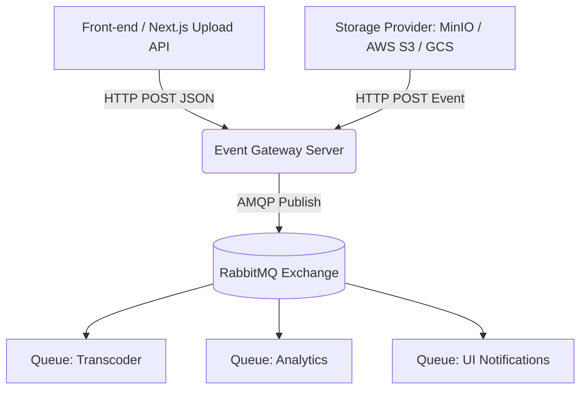

# Especificação Arquitetural


## Resumo da arquitetura:
Layer: Backend | Type: Microservice
Stack: GO + Mongodb + rabbitmq

Descrição: 
- Usuários: 100000
- Vídeos: 100
- Duração média (Length average): 300s
- Tamanho médio (Size average): 1gb

Conexões:
- Recebe conexão do Streaming platform upload
- Conexão com Storage (minIO ou S3)
- Conexão com MongoDB ao realizar upload bruto do video e salvar metadados, conforme o evento
- Conexão com RabbitMQ (Envia evento quando o vídeo deve ser processado e quando notifica upload finalizado)

Possibilidades de Infraestrutura:
- Google Cloud Run (Container)
- AWS ECS com Fargate (Container)
- AWS Lambda serverless (Atenção técnica: gerenciar limite de conexões simultâneas e cold-starts ao integrar com serviços persistentes como MongoDB e RabbitMQ)

----


## 1. Visão Geral da Arquitetura

Em vez da infraestrutura de storage (MinIO, S3) e da aplicação Next.js se conectarem diretamente e publicarem no RabbitMQ (via AMQP).

Este servidor exporá APIs HTTP/Webhooks para receber métricas e eventos de qualquer camada, validará o payload, formatará a mensagem baseada no provedor e fará a ponte exclusiva de publicação na fila do RabbitMQ.



## 2. Componentes e Fluxo de Dados

### 2.1 Front-end / Next.js Upload (Os Emissores de Status)
Enquanto o upload acontece, a aplicação envia requisições HTTP para o Event Gateway detalhando o progresso:
- **`upload.started`**: Enviado quando a transferência do arquivo é iniciada.
- **`upload.progress`**: Resumo periódico (ex: a cada 2 segundos ou 10% de chunk) dos bytes transferidos.
- **`upload.failed`**: Enviado se houver recusa de conexão ou erro no frontend/backend.

**Ação:** O Next.js/Front-end faz um `POST /api/v1/events` com o payload de status. Não há necessidade de instalar bibliotecas AMQP nesta camada.

### 2.2 Provedor de Storage (O Validador de Conclusão)
O Storage Provider (MinIO, AWS S3, ou outro) será configurado usando Eventos/Webhooks (HTTP) em vez de publicação direta para as filas. 
Quando o upload do arquivo é efetivado fisicamente no disco, o provedor aciona automaticamente o Webhook correspondente no Event Gateway. Como diferentes provedores possuem schemas JSON diferentes (ex: S3 envia S3Event, Azure envia EventGrid), o Event Gateway lida com as particularidades de cada um.

**Ação:** O provedor (MinIO, S3 + Lambda/EventBridge) faz um `POST /api/v1/webhooks/storage/:provider` no Event Gateway.

### 2.3 Event Gateway Server (O Coração da Mensageria)
Este novo microserviço (aplicação back-end de alta performance escrita em **Go**) será o **único** serviço que contém as credenciais e lógica de conexão com o RabbitMQ.

**Responsabilidades:**
1. **Recepção:** Oferecer endpoints altamente disponíveis para entrada de eventos.
2. **Normalização (Adpater Patter):** Parsear o payload do Front-end e, crucialmente, rotear e decodificar o payload específico de cada provedor de storage (MinIO, S3, GCS) usando *Adapters*. Assim, a infraestrutura interna lida apenas com um Evento de Domínio unificado.
3. **Tradução:** Converter o evento da infraestrutura de rede (`ObjectCreated`, `s3:TestEvent`) para o evento de domínio `upload.completed`.
4. **Publicação:** Enviar via canal AMQP para a *Topic Exchange* `video_events` no RabbitMQ, usando a chave de roteamento apropriada.

### 2.4 RabbitMQ (O Broker)
Recebe os eventos formatados pelo Event Gateway e usa *routing keys* (`video.upload.started`, `video.upload.completed`, etc.) para entregar a mensagem às filas de consumo e serviços em background (ex: os workers de transcoding).

## 3. Especificação da API Intermediária (Event Gateway)

### Endpoint 1: Eventos da Aplicação
`POST /api/v1/events`

Recebe todos os eventos de lifecycle gerados localmente.
**Corpo da Requisição (Exemplo Progresso):**
```json
{
  "eventType": "upload.progress",
  "payload": {
    "videoId": "123e4567-e89b-12d3...",
    "filename": "meu-video.mp4",
    "progress": 45.5,
    "uploadedBytes": 4550000,
    "totalBytes": 10000000
  }
}
```

### Endpoint 2: Webhook de Storage Abstrato
`POST /api/v1/webhooks/storage/:provider`

Este endpoint dinâmico serve como "sink" de eventos para qualquer provedor. O parâmetro `:provider` (ex: `minio`, `aws-s3`, `gcs`) direciona o payload para o adaptador correto em código.
**Comportamento do Gateway:** O servidor injeta o payload no adaptador de storage correspondente. O adaptador sabe exatamente como percorrer o JSON daquela cloud, extrair a chave (`videoId/filename`), checar se é evento de criação e gerar um evento padronizado (com size e timestamps) para publicação no RabbitMQ.

## 4. Como Configurar os Provedores de Storage

### Exemplo 1: Configuração no MinIO
Para o MinIO, a configuração é feita diretamente acionando um Webhook:
```bash
mc admin config set myminio notify_webhook:event_gw endpoint="http://<SEU-EVENT-GATEWAY>/:8080/api/v1/webhooks/storage/minio"
mc admin service restart myminio
mc event add myminio/videos arn:minio:sqs::event_gw:webhook --event put
```

### Exemplo 2: Configuração na AWS S3
Se a plataforma migrar para AWS, o S3 nativamente manda eventos para o **EventBridge**, **SNS**, ou **SQS**. Para acionar o Event Gateway HTTP:
1. S3 Native Event Actions -> Amazon SNS -> Assinatura HTTP/HTTPS apontando para o Gateway.
2. S3 Notification -> AWS Lambda -> Faz um `POST` no Gateway em `.../storage/aws-s3`.

## 5. Benefícios Desta Abstração

1. **Agnóstico a Cloud (Vendor Lock-in Prevented):** Se você trocar de MinIO local para AWS S3 na nuvem em produção, basta mudar a URL do webhook no S3 e apontar para `/storage/aws-s3`. O RabbitMQ e as aplicações front-end sequer saberão que o provedor mudou!
2. **Segurança de Credentials:** A aplicação Front-end, o provedor de Storage e a API de Upload não precisam ter acesso de rede ou credenciais do RabbitMQ. 
3. **Escalabilidade de Conexões:** Evita o esgotamento de conexões no broker. O Gateway mantém um pool persistente, distribuindo a carga de tráfego HTTP intensa.

## 6. Arquitetura e Implementação Tecnológica (Go)

Considerando a proposta do Event Gateway implementado em **Go (Golang)**, associado às facilidades de implementação via Inteligência Artificial, a estrutura arquitetural adotada foge do super-complexo e adota um modelo direto e isolado.

### 6.1 Framework Server Recomendado
- **Fiber**: Inspirado no Express, focado em performance extrema e facilidade de roteamento, excelente para construir webhooks que necessitam suportar alta carga sem pesar.
*Recomendação Primária: **Fiber** para maximizar velocidade de desenvolvimento do API Gateway de maneira concisa.*

### 6.2 Estrutura do Projeto Recomendada (Otimizada para IA)
A organização será baseada no **Standard Go Layout (`cmd/`, `internal/`)** combinada com o paradigma de **Slices Verticais (Vertical Slices)** e **Adapters (Design Hexagonal)**, focado em agrupar regras em pacotes por domínio (reducing boilerplates irrelevantes para que LLMs atuem atomicamente).

#### Mapeamento de Diretórios
```text
/cmd
  /api
    main.go                 # Entrypoint, instancia dependências (RabbitMQ, HTTP Server) e sobe as rotas
/internal
  /events                   # Contexto de eventos do frontend (Vertical Slice)
    handler.go              # Rota: POST /api/v1/events
    service.go              # Validação e roteamento interno de eventos de lifecycle
  /webhooks                 # Contexto de eventos de object storage (Vertical Slice)
    handler.go              # Rota: POST /api/v1/webhooks/storage/:provider
    service.go              # Lógica em identificar o provider e passar aos Adapters
  /adapters                 # Ports & Adapters (Interoperabilidade de provedores)
    storage_port.go         # Interface que dita ParseEvent(payload []byte) DomainEvent
    minio_adapter.go        # Implementação específica para body do MinIO
    s3_adapter.go           # Implementação específica para body AWS S3
  /rabbitmq                 # Serviço utilitário da infra de mensageria
    publisher.go            # Mantém pool persistente AMQP e publica na Topic Exchange
```

### 6.3 Especificações para Implementação da IA

A estrutura estabelecida permite delegar e pedir tarefas para os agentes IA sem quebrar o projeto:
1. **Ponto de Entrada (`/cmd/api`)**: A IA gera a inicialização do Server da rota, declarando rapidamente onde os "Handlers" são injetados. Exemplo: *"Inicialize de forma graciosa um Fiber app com logging e chame as rotas de events e webhooks"*.
2. **Expansão Dinâmica (`/internal/adapters`)**: Se a lógica demandar um novo cloud provider, você só precisa solicitar (*"Crie um gcs_adapter.go que traduza o evento do Google Cloud Storage para a interface storage*. Não quebra o código preexistente e mantém o payload limpo e concentrado.
3. **Desacoplamento de Webhooks (`/internal/webhooks`)**: Funciona consumindo o framework de HTTP para inspecionar `:provider` na URL. Encapsula essa responsabilidade sem a Inteligência Artificial envolver outras regras de negócio em arquivos aleatórios.
4. **Publisher AMQP (`/internal/rabbitmq`)**: Para esse pacote as instruções à IA são precisas como: *"Construa um RabbitMQ Publisher em go com canal em pooling e tratamento de reconexão usando github.com/rabbitmq/amqp091-go"*. Todo o isolamento garante resiliência e geração de código correta na primeira tentativa.

## 7. Ciclo de Vida de Upload e Exemplos de Integração (API)

O fluxo de status e progressão temporal de envio não é monitorado nativamente pelo Storage, mas sim fracionado em diferentes responsáveis da nossa arquitetura.

### 7.1 Quem emite os eventos de Lifecycle?

- **Os Emissores de Status e Progresso (Front-end / Aplicação Cliente):**
  A aplicação do lado do cliente deve mensurar a velocidade de upload e bytes finalizados postando requisições genéricas do andamento pelo nosso endpoint `/events`. Eventos recomendados: `upload.started`, `upload.progress`, `upload.failed`.
- **O Validador de Sucesso Conclusivo (MinIO/S3 - Object Storage):**
  O provedor entra em ação *apenas* no encerramento (100% gravado no disco). O bucket atinge o Webhook interno referenciando a rota `/webhooks/storage/:provider` ratificando a conclusão de forma segura e infalível, de modo protegido na rede interna, imune à perdas de pacote do front-end do usuário.

### 7.2 Exemplos Práticos (Payloads e Rotas)

Abaixo seguem exemplos padronizados de como invocar no Postman ou via terminal cada um dos endpoints do Gateway de Eventos (`localhost:8080`), replicando o que Front-ends e Back-ends fariam respectivamente.

#### A. Endpoint Frontend: Receber progressão do upload
**Rota:** `POST http://localhost:8080/api/v1/events`

Consumido pela aplicação durante o fracionamento do chunk/vídeo (Upload Activo).

**Exemplo cURL:**
```bash
curl -X POST http://localhost:8080/api/v1/events \
  -H "Content-Type: application/json" \
  -d '{
    "eventType": "upload.progress",
    "payload": {
      "videoId": "ebd23f99-c89b-43d9-a72a-1928fb211e40",
      "filename": "meu-video-teste.mp4",
      "progress": 55.4,
      "uploadedBytes": 5540000,
      "totalBytes": 10000000
    }
  }'
```
**Resultado Esperado:** Repassará a mensagem à exchange com a routing key: `video.upload.progress`.

#### B. Endpoint Back-end: Storage Webhook (Confirmação Final do MinIO/S3)
**Rota:** `POST http://localhost:8080/api/v1/webhooks/storage/minio`

Invocado apenas pela infraestrutura automatizada nativa por intermédio de Webhooks HTTP e sem intervenção do front-end. O padrão varia por Storage, mas os "Adapters" convertem e abstraem os dados subjacentes para o RabbitMQ central.

**Exemplo cURL simulando o body injetado pelo MinIO:**
```bash
curl -X POST http://localhost:8080/api/v1/webhooks/storage/minio \
  -H "Content-Type: application/json" \
  -d '{
    "EventName": "s3:ObjectCreated:Put",
    "Key": "videos/ebd23f99-c89b-43d9-a72a-1928fb211e40/meu-video-teste.mp4",
    "Records": [
      {
        "eventTime": "2026-04-21T18:00:00Z",
        "s3": {
          "object": {
            "key": "videos/ebd23f99-c89b-43d9-a72a-1928fb211e40/meu-video-teste.mp4",
            "size": 10000000
          }
        }
      }
    ]
  }'
```
**Resultado Esperado:** Retorno `200 OK` para o Bucket/Storage. O Adaptador em Go extrai a propriedade de url-paths atrelada em `Key`, retira o Guid de rastreio (`ebd23f99-c89b-43d9-a72a-1928fb211e40`) e repassa para a mensageria na key definitiva garantida de `video.upload.completed`.
